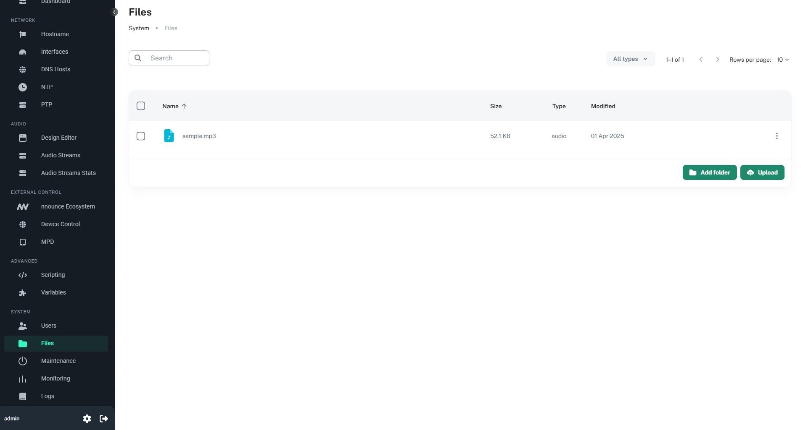
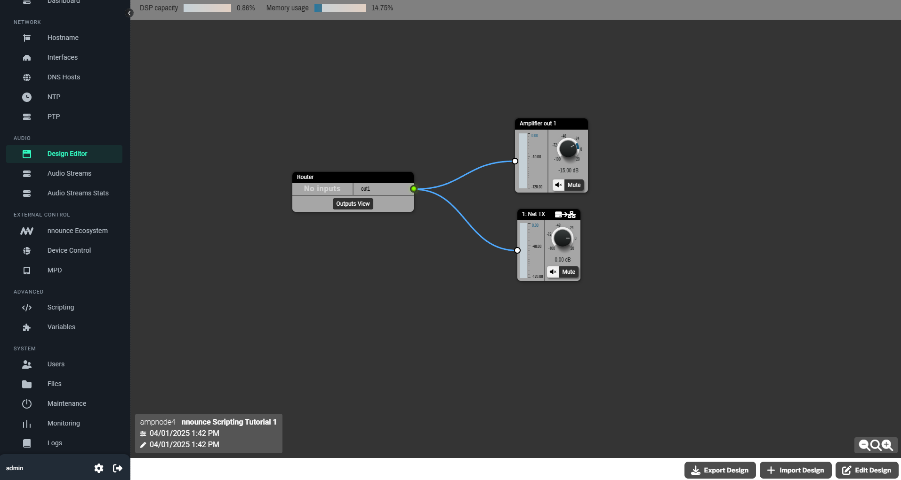
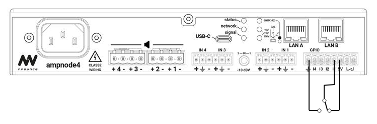
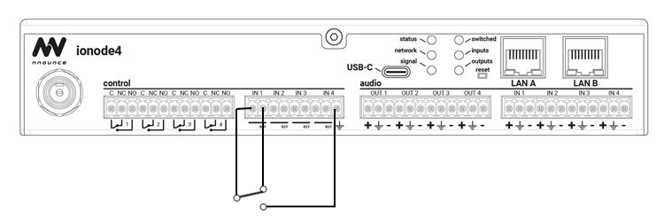

# Tutorial 1: Play local file when an input pin is set high (on cooldown)

1. [Introduction](#introduction)
2. [Before you start](#before-you-start)
3. [Uploading file to device](#uploading-file-to-device)
4. [Creating and deploying a design](#creating-and-deploying-a-design)
5. [Writing the script](#writing-the-script)
6. [Triggering the input](#triggering-the-input)


## Introduction
Some nnounce devices have control inputs, outputs or configurable GPIO pins (e.g. `ampnode4`, `ionode4`, `micnode2g` and `micnode2h`). 
You can utilize these via scripting to perform actions based on their states.  

This tutorial primarily targets `ampnode4` and `ionode4`, using input pin 1 as a trigger to execute script-defined action.

Most control inputs can be used in two modes - analog or digital. 
More details are available in the nnounce scripting documentation through the nnounce web UI.
Further scripting information can be found in the nnounce configuration guide at [https://docs.simpleway.cloud/nnounce/docs/scripting](https://docs.simpleway.cloud/nnounce/docs/scripting).

In this tutorial, we will use input pin 1 in digital mode. When set high, the device will play a local file (stored on the device). 
A cooldown period will ensure the file plays at most once every 60 seconds.

To achieve this, we need to go through several steps:
1. Upload a file to the nnounce device
2. Create and deploy a design
3. Write a script to play uploaded file with cooldown logic
4. Trigger the script by setting input pin high

## Before you start
Ensure that you:
- have an audio file in .mp3, .flac or .wav format
- have an nnounce device connected, running and reachable from your computer
- have a method to trigger the input pin

> Note: All steps of this tutorial assume you are logged in to the device.

## Uploading file to device
1. Navigate to the **Files** tab
2. Click the **Upload** button
3. Select and upload your file

You should now see your file listed in the **Files** tab.


More details on file management can be found in the nnounce configuration guide at [https://docs.simpleway.cloud/nnounce/docs/file-manager](https://docs.simpleway.cloud/nnounce/docs/file-manager).

## Creating and deploying a design
To play a local file, the device needs a minimal design setup, including a Router component and and output - either Analog/Amplifier Out or Net TX or both.

1. Navigate to the **Design Editor** tab
2. Click the **Edit design** button if a design is already running
3. Add a Router component from the I/O menu
4. Add a Router Output and name it `out1`. *(You can choose any name, but ensure the script uses the correct name.)*
5. Add some Analog/Amplifier output (depending on the nnounce device) and/or Net TX component
6. Connect Router output `out1` to the chosen output component
7. Click the **Deploy Design** button

Your design should resemble this:


To hear playback, connect speakers to the device audio output or configure a stream to listen to it.

More details on Design Editor can be found in the nnounce configuration guide at [https://docs.simpleway.cloud/nnounce/docs/designer-dsp-configuration](https://docs.simpleway.cloud/nnounce/docs/designer-dsp-configuration).

More details on streaming setup can be found in the nnounce configuration guide at [https://docs.simpleway.cloud/nnounce/docs/audio-streams](https://docs.simpleway.cloud/nnounce/docs/audio-streams).

## Writing the script
With the file uploaded and design deployed, we now create a script that plays the file when input pin is triggered.

1. Navigate to the **Scripting** tab
2. Click the **+** button
3. Fill-in name input field
4. Select **Background** mode
5. Paste script below
```typescript
// let the user know the script started
console.log("Starting tutorial script 1");

let playbackAvailable = true; // cooldown flag

nnApi.controlInputs.digital(1) // use pin 1 in digital mode, pins are numbered from 1
		.onChange((val) => {  // function to handle input value changes
			console.log(`Change on digital input 1 - current value: ${val}`); // log current input pin value
			if (val) { // if pin is high (true)...
				if (!playbackAvailable) {  // if cooldown is active, log and return
					console.log("Playback not available yet");
					return;
				}
				nnApi.pagingRouter.playLocalFile(  // cooldown ready, proceed to play local file
						{
							priority: 2,  // priority - the lower the number, the higher the priority
							audioFilePath: "sample.mp3", // file path
							outputs: ["out1"]   // list of router outputs the file will be played to
						}
				);
				console.log(`Playing local file sample.mp3`); // let the user know the file is playing
				playbackAvailable = false;  // disable playback
				setTimeout( // re-enable playback after 60s cooldown
						() => {
							console.log("Playback available");
							playbackAvailable = true;
						},
						60000,
				);
			}
		});
```
6. Click the **Save & Exit** button

More details on scripting can be found in the nnounce configuration guide at [https://docs.simpleway.cloud/nnounce/docs/scripting](https://docs.simpleway.cloud/nnounce/docs/scripting).

## Triggering the input

Pin schematics for ampnode4 and ionode4:

  
More details on ampnode4 features can be found in the nnounce installation guide at [https://docs.simpleway.cloud/nnounce/docs/features-ampnode4](https://docs.simpleway.cloud/nnounce/docs/features-ampnode4).

  
More details on ionode4 features can be found in the nnounce installation guide at [https://docs.simpleway.cloud/nnounce/docs/features-ionode4](https://docs.simpleway.cloud/nnounce/docs/features-ionode4).

More on other products can be found on nnounce website at [https://www.nnounce.com/](https://www.nnounce.com/), or in installation guides at [https://docs.simpleway.cloud/nnounce/docs/installation-guides](https://docs.simpleway.cloud/nnounce/docs/installation-guides).

---

This tutorial has covered uploading a file, creating a minimal design, writing a script with cooldown logic, and triggering the input pin. Happy coding!