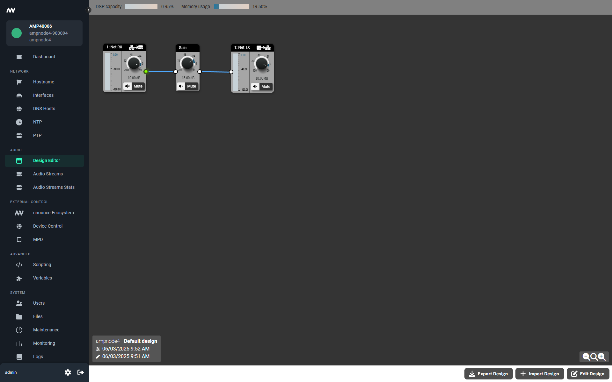

# nnounce Scripting - Snippets and Visual Studio Code setup

1. [Introduction](#introduction)
2. [Setting up Visual Studio Code](#setting-up-visual-studio-code)
3. [Snippet subfolders](#snippet-subfolders)

## Introduction
Scripting on nnounce devices is available using Deno JavaScript runtime.

Scripts are written in TypeScript. 
All snippets presented in this project are available also in code editor in nnounce scripting UI.

Using Visual Studio Code for nnounce scripting enables debugging the scripts. 
Snippets are divided into categories and each category has its own subfolder. 
Each subfolder is structured as multi-root workspace for VS Code.

All snippets are meant to run on one nnounce device.
If you want to manage more nnounce devices from your scripts, see [Managing multiple nnounce devices](../examples/multipleDevices/README.md) tutorial.

This guideline was tested with Deno version 2.2.6.

## Setting up Visual Studio Code
To enable scripting on nnounce devices from Visual Studio Code, follow these steps:
1. Install Deno JavaScript runtime ([https://docs.deno.com/runtime/getting_started/installation/](https://docs.deno.com/runtime/getting_started/installation/))
1. Open command line and verify Deno executable is on system path by typing `deno` and pressing enter
   
1. Download and install Visual Studio Code ([https://code.visualstudio.com/download](https://code.visualstudio.com/download))
1. Install Deno extension for VS Code
    1. Go to **Extensions** tab and search for Deno
    2. Install extension  
       
1. Download entire scripting demo project or particular snippets subfolder.
1. Setup environment properties
   1. If you downloaded entire scripting demo project, open `cmd`, navigate to `snippets` folder and run provided `setup.ts` script with deno command
   ```
   deno run --allow-read --allow-write setup.ts
   ```
   The script will ask for hostname and api-key to connect to your nnounce device and will fill them in every `.env` file in the snippets subprojects.
   You should see similar output:
   
   2. If you downloaded only some of the snippet subprojects, edit the `.env` file located in project folder root. Fill in hostname or ip address of your nnounce device.
   ```
    HOSTNAME=
    API_KEY=
    ```
1. Open any snippet project by clicking **File -> Open Workspace from File...** and navigate to file with `.code-workspace` extension. 
1. Select the launch configuration you are interested in and click Start Debugging or press F5.
    

## Snippet Subfolders

### Buttons
Snippets focusing on control of device buttons. 
These snippets are usable only on **micnode2h** and **micnode2g**, as other devices do not have any buttons or do not support scripting.

Following snippets are available:
- Handle momentary button press
- Handle momentary button release
- Handle toggle button change
- Get state of momentary button

### Control IO
Snippets focusing on control inputs and outputs can be found in `controlIO` project subfolder. 
Not all nnounce devices have control I/O capablities, so these snippets are usable only with **ampnode4**, **ionode4**, **micnode2h** and **micnode2g** variants.

Following snippets are available:
- Handle change on input pin in digital mode
- Output control pin in relay mode - open
- Output control pin in relay mode - close
- Output control pin in relay mode - get open state
- Output control pin in relay mode - get closed state

### DSP
Snippets focusing on components used in nnounce DSP can be found in `dsp` project subfolder. 

These snippets will not work with **controlnode**, **micnode mini3**, **micnode mini6** and **wallnode** devices.

There needs to be some minimal nnounce design for these snippets to work.
Please ensure you add components in this specific order: Gain first, then Net RX, and finally Net TX. The snippets will not work correctly if this order is not followed.

More on design and Design Editor can be found in the nnounce configuration guide at [https://docs.simpleway.cloud/nnounce/docs/designer-dsp-configuration](https://docs.simpleway.cloud/nnounce/docs/designer-dsp-configuration).



Following snippets are available:
- Get gain value of Gain component
- Set gain value of Gain component
- Get mute state of Gain component
- Set mute state of Gain Component
- Get gain value of Net RX component
- Set gain value of Net RX component
- Get mute state of Net RX component
- Set mute state of Net RX Component
- Get gain value of Net TX component
- Set gain value of Net TX component
- Get mute state of Net TX component
- Set mute state of Net TX Component

### PA Router
Snippets focusing on playing files (local or remote) into PA router output(s) can be found in `paRouter` project subfolder.

These snippets will not work with **controlnode**, **micnode mini3**, **micnode mini6** and **wallnode** devices.

There needs to be some local file and minimal nnounce design for these snippets to work.
The analog output can be swapped with **Net Tx** component if you would like to stream it to other device.

More on file management can be found in the nnounce configuration guide at [https://docs.simpleway.cloud/nnounce/docs/file-manager](https://docs.simpleway.cloud/nnounce/docs/file-manager).

More on audio streams can be found in the nnounce configuration guide at [https://docs.simpleway.cloud/nnounce/docs/audio-streams](https://docs.simpleway.cloud/nnounce/docs/audio-streams).

More on design and Design Editor can be found in the nnounce configuration guide at [https://docs.simpleway.cloud/nnounce/docs/designer-dsp-configuration](https://docs.simpleway.cloud/nnounce/docs/designer-dsp-configuration).


Following snippets are available:
- Play local file
- Play remote file
- Cancel playing file

### System Info
Snippets in `systemInfo` project subfolder focus on getting information about connected device.

You can get hardware information - serial number, model, firmware version and other.

You can also get device network configuration - available interfaces, IPv4 and IPv6 addresses, hostname and MAC address.

Following snippets are available:
- Get device hostname
- Get list of device network interfaces
- Get IPv4 address of network interface
- Get IPv6 address of network interface
- Get MAC address of network interface
- Get firmware version
- Get device model
- Get device model type
- Get device serial number
- Get device version

### System Variables
Snippets in `systemVariables` project subfolder focus on reading user-defined system variables.

More on system variables can be found in the nnounce configuration guide at [https://docs.simpleway.cloud/nnounce/docs/variables](https://docs.simpleway.cloud/nnounce/docs/variables).

Following snippets are available:
- Get user-defined variable value
- Get user-defined variable value as boolean
- Get user-defined variable value as number

### Other
Snippets focusing on parts of nnounce scripting that do not fall into any previous category can be found in `other` project subfolder.

Following snippets are available:
- Enable inner scripting API logging
- Use logger
- Subscribe for SNMP trap

---

This tutorial covered setup of environment for Visual Studio Code and contents snippets. Happy coding!